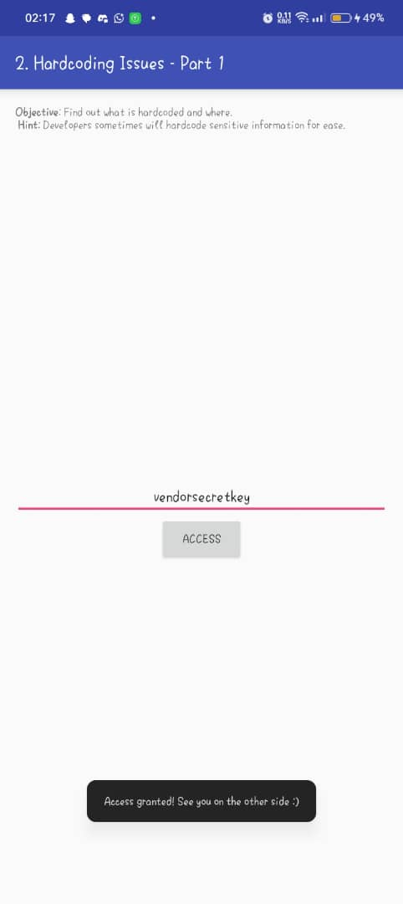

## Table of Contents
0. [Introduction](#0-introduction)
1. [Insecure Logging](#1-insecure-logging)
2. [Hardcoded Issues (Part1)](#2-hardcoded-secrets-java)
3. [Hardcoded Issues (Part2)](#3-hardcoded-secrets-native-code)
4. [Insecure Data Storage - SharedPreferences](#4-insecure-data-storage---sharedpreferences)
5. [Insecure Data Storage - SQLite Database](#5-insecure-data-storage---sqlite-database)
6. [Insecure Data Storage - Temporary File](#6-insecure-data-storage---temporary-file)
7. [Insecure Data Storage - External Storage](#7-insecure-data-storage---external-storage)
8. [Input Validation - SQL Injection](#8-input-validation---sql-injection)
9. [Input Validation - WebView File Access](#9-input-validation---webview-file-access)
10. [Access Control Issues - Part 1](#10-access-control-issues---part-1)
11. [Access Control Issues - Part 2](#11-access-control-issues---part-2)
12. [Access Control Issues - Part 3](#12-access-control-issues---part-3)
13. [Input Validation - JavaScript Injection](#13-input-validation---javascript-injection)

---

## 0. Introduction
## Environment Setup and Tools

- **Android Emulator:** Install Android Studio or Genymotion and create a virtual device (*AVD*) without Google Play.
- **DIVA APK:** [Download DIVA]([(https://github.com/0xArab/diva-apk-file/blob/main/DivaApplication.apk)]) or compile it manually.
- **ADB (Android Debug Bridge):** For installing APKs, inspecting logs/files.
- **Static Analysis Tools:** `JADX-GUI`, `Apktool`, `Ghidra`/`IDA Free`.
- **Optional Tools:** `Burp Suite`, `Frida`, `Drozer`.

---

## Static Analysis Steps

- **Inspect AndroidManifest.xml:** Find exported Activities/Services/Providers.
- **Look for Hardcoded Strings:** Search for API keys, passwords.
- **Identify Unsafe APIs:** `Log.e()`, plaintext storage, `loadUrl()`, etc.
- **Trace Input Handling:** Look for bad concatenations, unchecked parameters.

---

## Dynamic Analysis Techniques

- Use `adb logcat` to monitor logs.
- Shell into the app’s private storage with `adb shell`.
- Invoke exported components via `adb shell am start`.
- Pull databases/files with `adb pull`.
- Analyze database files with `sqlite3` or SQLite Browser.


## 1. Insecure Logging

- Firstly, I used Jadx-gui to decompile the application, from there I was able to view part a part in the decompiled code that had code related to how inputs are being logged.


- After this, I proceeded to setup Adb to interact with the application on my mobile device.


- This shows that my android devices is attached successful to ADb and I can now interact and see the process ID of the applications on the device.


- After connecting I proceeded to the first task on the vulnerable application which is Insecure Logging.Here after i opening i got an inut prompt that asked for my credit card details. I inputted it here and by the side i used `logcat` on adbshell to check how information inputted in that input field is logged.
      

- From this, I was able to see that the information is actually logged in plain text using the command below in `adb shell`
```bash
adb logcat | grep diva-log
```


**Remediation:** Avoid logging sensitive information. Use secure logging practices and sanitize inputs before logging.

---

## 2. Hardcoded Issues (Part 1)

- For this part,frstly i looked through the decompiled application again,at the source code section. I saw an intersting file named `HardcodeActivity`, on viewing this file i saw implementation where a key check is done i.e users input is checked with the actuall key. This key is hardcoded.


- To test if this is actually present on the application, we input a key not equal to what is hardcoded and one equal to it to see the difference.

<div style="display: flex; justify-content: space-between; align-items: center;">
  
  
</div>


**Remediation:** Store secrets securely using Android's Keystore system or secure server-side storage.

---

## 3. Hardcoded Secrets (Native Code)

- **Description:** Secrets are embedded within native libraries (`.so` files).

**Steps to Exploit:**

1. Extract the `libdivajni.so` file from the APK.
2. Analyze the library using tools like `Ghidra` or `IDA Pro`.
3. Locate functions like `Java_jakhar_aseem_diva_DivaJni_access` to find hardcoded secrets.

> **📸 Screenshot Placeholder:** *Disassembled native code revealing secrets.*

**Remediation:** Avoid hardcoding secrets in native code. Use secure storage mechanisms.

---

## 4. Insecure Data Storage - SharedPreferences

- **Description:** Sensitive data is stored in plaintext within `SharedPreferences`.

**Steps to Exploit:**

1. Launch the **Insecure Data Storage - Part 1** challenge.
2. Enter sample credentials and save.
3. Access the `shared_prefs` directory:

```bash
adb shell
cd /data/data/jakhar.aseem.diva/shared_prefs/
cat jakhar.aseem.diva_preferences.xml
```

> **📸 Screenshot Placeholder:** *SharedPreferences file displaying plaintext credentials.*

**Remediation:** Use `EncryptedSharedPreferences` or other encryption methods to secure stored data.

---

## 5. Insecure Data Storage - SQLite Database

- **Description:** Credentials are stored in an unencrypted SQLite database.

**Steps to Exploit:**

1. Launch the **Insecure Data Storage - Part 2** challenge.
2. Enter sample credentials and save.
3. Access and pull the database:

```bash
adb shell
cd /data/data/jakhar.aseem.diva/databases/
adb pull ids2
sqlite3 ids2
sqlite> SELECT * FROM myuser;
```

> **📸 Screenshot Placeholder:** *SQLite database displaying stored credentials.*

**Remediation:** Encrypt sensitive data before storing in databases or use encrypted databases.

---

## 6. Insecure Data Storage - Temporary File

- **Description:** Sensitive data is written to temporary files in plaintext.

**Steps to Exploit:**

1. Launch the **Insecure Data Storage - Part 3** challenge.
2. Enter sample credentials and save.
3. Locate and read the temporary file:

```bash
adb shell
cd /data/data/jakhar.aseem.diva/
ls | grep uinfo
cat uinfo*.tmp
```

> **📸 Screenshot Placeholder:** *Temporary file displaying stored credentials.*

**Remediation:** Avoid storing sensitive data in temporary files or ensure they are securely deleted after use.

---

## 7. Insecure Data Storage - External Storage

- **Description:** Sensitive data is stored on external storage, accessible by other apps.

**Steps to Exploit:**

1. Launch the **Insecure Data Storage - Part 4** challenge.
2. Enter sample credentials and save.
3. Access the external storage:

```bash
adb shell
cd /mnt/sdcard
ls -la | grep .uinfo.txt
cat .uinfo.txt
```

> **📸 Screenshot Placeholder:** *External storage file displaying stored credentials.*

**Remediation:** Avoid storing sensitive data on external storage or encrypt it before storage.

---

## 8. Input Validation - SQL Injection

- **Description:** User input is concatenated into SQL queries without proper sanitization.

**Steps to Exploit:**

1. Launch the **Input Validation - Part 1** challenge.
2. Enter the following payload:

```
' OR '1'='1
```

3. Observe if unauthorized access is granted.

> **📸 Screenshot Placeholder:** *App interface showing successful SQL injection.*

**Remediation:** Use parameterized queries or prepared statements to prevent SQL injection.

---

## 9. Input Validation - WebView File Access

- **Description:** WebView loads user-supplied URLs without validation, allowing local file access.

**Steps to Exploit:**

1. Launch the **Input Validation - Part 2** challenge.
2. Enter the following URL:

```
file:///sdcard/.uinfo.txt
```

3. Observe if the local file content is displayed.

> **📸 Screenshot Placeholder:** *WebView displaying contents of a local file.*

**Remediation:** Validate and sanitize URLs before loading them in WebView. Disable file access if not required.

---

## 10. Access Control Issues - Part 1

- **Description:** Activities can be launched without proper authentication.

**Steps to Exploit:**

1. Use `JADX` to identify exported activities.
2. Launch the activity directly:

```bash
adb shell am start -a jakhar.aseem.diva.action.VIEW_CREDS
```

> **📸 Screenshot Placeholder:** *App interface displaying sensitive information without authentication.*

**Remediation:** Implement proper access controls and restrict exported activities.

---

## 11. Access Control Issues - Part 2

- **Description:** Activities requiring PINs can be bypassed using intent extras.

**Steps to Exploit:**

1. Use `JADX` to identify the activity and required extras.
2. Launch the activity with manipulated extras:

```bash
adb shell am start -n jakhar.aseem.diva/.APICreds2Activity -a jakhar.aseem.diva.action.VIEW_CREDS2 --ez check_pin false
```

> **📸 Screenshot Placeholder:** *App interface displaying sensitive information after bypassing PIN.*

**Remediation:** Validate intent extras and implement proper authentication checks.

---

## 12. Access Control Issues - Part 3

- **Description:** Sensitive data is stored in shared preferences without proper protection.

**Steps to Exploit:**

1. Access the shared preferences:

```bash
adb shell
cd /data/data/jakhar.aseem.diva/shared_prefs/
cat jakhar.aseem.diva_preferences.xml
```

2. Extract the stored PIN or credentials.

> **📸 Screenshot Placeholder:** *SharedPreferences file displaying stored PIN.*

**Remediation:** Store sensitive data securely and avoid storing authentication tokens in plaintext.

---

## 13. Input Validation - JavaScript Injection

- **Description:** WebView loads user-supplied URLs without validation, allowing JavaScript injection.

**Steps to Exploit:**

1. Launch the **Input Validation - Part 2** challenge.
2. Enter the following URL:

```
javascript:alert('XSS')
```

3. Observe if the JavaScript is executed.

> **📸 Screenshot Placeholder:** *WebView displaying an alert box from injected JavaScript.*

**Remediation:** Disable JavaScript in WebView or validate URLs before loading. Avoid loading untrusted content.

---
