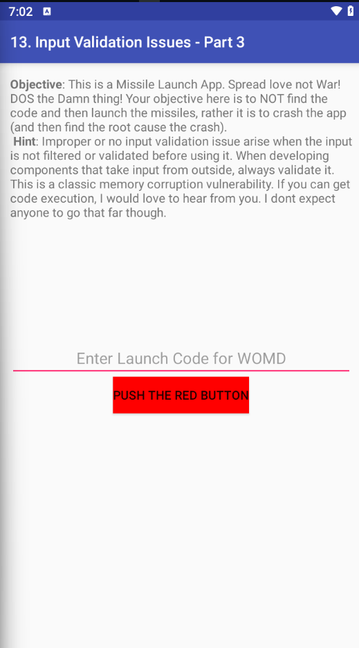
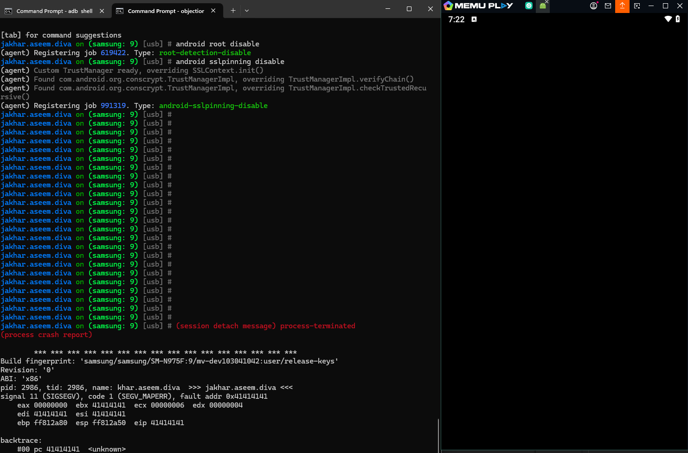

## Table of Contents

0. [Introduction](#0-introduction)
1. [Insecure Logging](#1-insecure-logging)
2. [Hardcoded Issues (Part1)](#2-hardcoded-secrets-java)
3. [Insecure Data Storage - SharedPreferences](#4-insecure-data-storage---sharedpreferences)
4. [Insecure Data Storage - SQLite Database](#5-insecure-data-storage---sqlite-database)
5. [Insecure Data Storage - Temporary File](#6-insecure-data-storage---temporary-file)
6. [Insecure Data Storage - External Storage](#7-insecure-data-storage---external-storage)
7. [Input Validation - SQL Injection](#8-input-validation---sql-injection)
8. [Input Validation - WebView File Access](#9-input-validation---webview-file-access)
9. [Access Control Issues - Part 1](#10-access-control-issues---part-1)
10. [Access Control Issues - Part 2](#11-access-control-issues---part-2)
11. [Access Control Issues - Part 3](#12-access-control-issues---part-3)
12. [Hardcoded Issues (Part2)](#2-hardcoded-secrets-java)
13. [Input Validation - JavaScript Injection](#13-input-validation---javascript-injection)

---

## 0. Introduction

## Environment Setup and Tools

- **Android Emulator:** Install Android Studio or Genymotion and create a virtual device (_AVD_) without Google Play.
- **DIVA APK:** [Download DIVA](<[(https://github.com/0xArab/diva-apk-file/blob/main/DivaApplication.apk)]>) or compile it manually.
- **ADB (Android Debug Bridge):** For installing APKs, inspecting logs/files.
- **Static Analysis Tools:** `JADX-GUI`, `Apktool`, `Ghidra`/`IDA Free`.
- **Optional Tools:** `Burp Suite`, `Frida`, `Drozer`.

---

## Static Analysis Steps

- **Inspect AndroidManifest.xml:** Find exported Activities/Services/Providers.
- **Look for Hardcoded Strings:** Search for API keys, passwords.
- **Identify Unsafe APIs:** `Log.e()`, plaintext storage, `loadUrl()`, etc.
- **Trace Input Handling:** Look for bad concatenations, unchecked parameters.

---

## Dynamic Analysis Techniques

- Use `adb logcat` to monitor logs.
- Shell into the app’s private storage with `adb shell`.
- Invoke exported components via `adb shell am start`.
- Pull databases/files with `adb pull`.
- Analyze database files with `sqlite3` or SQLite Browser.

## 1. Insecure Logging

- Firstly, I used Jadx-gui to decompile the application, from there I was able to view part a part in the decompiled code that had code related to how inputs are being logged.
  

- After this, I proceeded to setup Adb to interact with the application on my mobile device.
  

- This shows that my android devices is attached successful to ADb and I can now interact and see the process ID of the applications on the device.
  

- After connecting I proceeded to the first task on the vulnerable application which is Insecure Logging.Here after i opening i got an inut prompt that asked for my credit card details. I inputted it here and by the side i used `logcat` on adbshell to check how information inputted in that input field is logged.
  

- From this, I was able to see that the information is actually logged in plain text using the command below in `adb shell`

```bash
adb logcat | grep diva-log
```


**Remediation:** Avoid logging sensitive information. Use secure logging practices and sanitize inputs before logging.

---

## 2. Hardcoded Issues (Part 1)

  

  - For this part,frstly i looked through the decompiled application again,at the source code section. I saw an intersting file named `HardcodeActivity`, on viewing this file i saw implementation where a key check is done i.e users input is checked with the actuall key. This key is hardcoded.

  

  - To test if this is actually present on the application, we input a key not equal to what is hardcoded and one equal to it to see the difference.

  <div style="display: flex; justify-content: space-between; align-items: center;">
    
    
  </div>

  **Remediation:** Store secrets securely using Android's Keystore system or secure server-side storage.

  ---

  ## 3. Insecure Data Storage - SharedPreferences(part 2)

  - **Description:** Secrets are embedded within native libraries (`.so` files).

  **Steps to Exploit:**

  1. using Jadx to decompile, i noticed that credetials were stored in a folder.
    

  2. using ADB shell, i located the folder where it was stored an then saw the credetials were stored in plain text insdide an XML file
    

**Remediation:** Avoid hardcoding secrets in native code. Use secure storage mechanisms.

---

## 4. Insecure Data Storage - SQLite Database

- **Description:** Credentials are stored in an unencrypted SQLite database.

**Steps to Exploit:**

1.  Launch the **Insecure Data Storage - Part 2** challenge.
2.  Enter service credentials and save.
    

        Based on the image above, we can identify where the credentials are stored and observe that they are saved in an SQL database format. Our next step is to locate the database that contains the ids2 entry and determine whether it is a directory or a readable file.

    
    
    As seen above, we will first input user credentials to ensure data is written to the database, which we will then attempt to locate.

3.  Access the Database:

    

    This above shows that the file is not readable from the shell and is a db file.

        Now we would exit from the shell and pull the file to our local system
        ```bash
        adb pull /data/data/jakhar.aseem.diva/databases/ids2
        ```
        
        After pulling the db file we were able to see the content with the username and password of the service stored in it.
        

    ```bash
    adb shell
    cd /data/data/jakhar.aseem.diva/shared_prefs/
    cat jakhar.aseem.diva_preferences.xml
    ```

    ```sql
    adb shell
    cd /data/data/jakhar.aseem.diva/databases/
    adb pull ids2
    sqlite3 ids2
    sqlite> SELECT * FROM myuser;
    ```

**Remediation:** Use `EncryptedSharedPreferences` or other encryption methods to secure stored data.

---

## 5. Insecure Data Storage - Temporary File

- **Description:** Sensitive data is written to temporary files in plaintext.

  **Steps to Exploit:**

1. Launch the **Insecure Data Storage - Part 3** challenge.
2. Enter sample credentials and save.
   
3. Locate and read the temporary file:
   From the above , we see that the temporary file is created when the user clicks save on the aplication
   
4. Checking the content of the file, we see that the credentials are indeed stored in the file.

   

**Remediation:** Avoid storing sensitive data in temporary files or ensure they are securely deleted after use.

---

## 6. Insecure Data Storage - External Storage

- **Description:** Sensitive data is stored on external storage, accessible by other apps.

**Steps to Exploit:**

1. Launch the **Insecure Data Storage - Part 4** challenge.

   While analyzing the application's source code using Jadx-gui, I discovered where the user credentials are being saved, along with the specific filename. The credentials are stored on the external storage of the Android device.

   

   Enter sample credentials on the application and save.

   

   After this, we use adb shell to check the sdcaard storage if the credetials are being saved in there.

   

2. Locate and read the temporary file:

```bash
adb shell
cd /mnt/sdcard
ls -la | grep .uinfo.txt
cat .uinfo.txt
```

**Remediation:** Avoid storing sensitive data on external storage or encrypt it before storage.

---

## 7. Input Validation - SQL Injection

- **Description:** Sensitive data is stored on external storage, accessible by other apps.

**Steps to Exploit:**

1. Launch the **Input Validation - Part 1** challenge.

   While checking the jadx code we see implementation of how input is checked against SQL credentials, this gives us an insight that the application could be vulnerable to SQL injection
   

2. Enter the following payload:

   On the aplication, we observed that the it is vulnerable to SQL injection attack.

   ```bash
     ' OR '1'='1--
   ```

   <div style="display: flex; justify-content: space-between; align-items: center;">
     
     
   </div>

**Remediation:** Use parameterized queries or prepared statements to prevent SQL injection.

---

## 8. Input Validation - WebView File Access

- **Description:** WebView loads user-supplied URLs without validation, allowing local file access.

**Steps to Exploit:**

1. Launch the **Input Validation - Part 2** challenge.
2. Enter the following URL:
   ```
   file:///sdcard/.uinfo.txt
   ```
   

**Remediation:** Validate and sanitize URLs before loading them in WebView. Disable file access if not required.

---

## 9. Access Control Issues - Part 1

- **Description:** Activities can be launched without proper authentication.

**Steps to Exploit:**

1. Use `JADX` to identify exported activities.

   In this challenge, the app provides a button labeled "View API Credentials". When clicked, it displays sensitive API credentials. The objective is to access these credentials without using the app's interface,
   <div style="display: flex; justify-content: space-between; align-items: center;">
   
   
   </div>

   Also, using jadx, we identify a identity class that shows how the API credentials are hardcoded
   
   We would be using `logcat` to see monitor for this Activity information. To do this, we would start monitoring logcat using

   ```less
   adb logcat
   ```

   After this, we go back to the Diva mobile application and click on view credential and see the logcat output for anything related to `APICredsActivity`

   

   This indicates that the APICredsActivity is responsible for displaying the credentials.

2. Launch the activity directly:
   Now, attempt to start the activity without using the app's interface.
   Using ADB Shell:
   ```less
   adb shell am start -a jakhar.aseem.diva.action.VIEW_CREDS
   ```
   This command launches the APICredsActivity directly.Upon execution, the activity should display the API credentials without touching the button.
   

**ISSUE:** The core issue here is the lack of proper access control. The APICredsActivity is exported and can be launched by any component, including external ones. This means that even without proper authentication or authorization, an attacker can access sensitive information by directly invoking this activity.

**Remediation:**

- Implement proper access controls and restrict exported activities.
  Restrict Activity Exposure:

- Set `android:exported="false"` for activities that should not be accessible externally.

- Ensure that sensitive activities perform proper authentication and authorization checks before displaying sensitive information.

- Define and enforce custom permissions for activities that need to be accessed by other applications.

---

## 10. Access Control Issues - Part 2

- **Description:** Activities requiring PINs can be bypassed using intent extras.Access the Tveeter API credentials without registering or providing a PIN. This simulates a scenario where an attacker exploits improper access controls to retrieve sensitive information.
  **Step-by-Step Walkthrough**

1.  Launch the DIVA App

    - Open the DIVA app on your device.
    - Navigate to Access Control Issues – Part 2.

      

      Observe 3 things:

      - The aplication allows us to view the API credentials when we click on the view API credentilas button without clicking any of the radio input.
      <div style="display: flex; justify-content: space-between; align-items: center;">
        
        
      </div>

      - The applicaton allow us to view the the API credentials also when we click on Already Registered then click on the View credentials button.
      <div style="display: flex; justify-content: space-between; align-items: center;">
        
        
      </div>

      - The app prompts for a PIN to view the Tveeter API credentials when we click on Register Now.
      <div style="display: flex; justify-content: space-between; align-items: center;">
        
        
        </div>

2.  Monitor Logcat for Activity Information
    Open a terminal and start monitoring logcat:

    ```bash
    adb logcat
    ```

    In the DIVA app, attempt to view the credentials.In the logcat output, look for the activity that's launched. You should see something like:

    ```less
    Starting activity: Intent { cmp=jakhar.aseem.diva/.APICreds2Activity }
    ```

    This indicates that the APICreds2Activity is responsible for displaying the credentials.
    

3.  Decompile the APK to Inspect the Activity. Use JADX to decompile the DIVA APK and Navigate to the APICreds2Activity class.
    
    Observe that the activity checks for a boolean extra named check_pin. If check_pin is false, the activity bypasses the PIN verification and displays the credentials.

4.  Launch the Activity Directly via ADB with Modified Parameters
    Since the credentials are displayed when check_pin is false, we can launch this activity directly with the appropriate intent:
    `bash
adb shell am start -n jakhar.aseem.diva/.APICreds2Activity -a jakhar.aseem.diva.action.VIEW_CREDS2 --ez check_pin false
`
    This command starts the APICreds2Activity with the check_pin extra set to false, effectively bypassing the PIN verification.
    Upon execution, the activity should display the Tveeter API credentials, achieving our objective without registering or entering a PIN.
    <div style="display: flex; justify-content: space-between; align-items: center;">
    
    
    </div>
    
[**ISSUES:** The core issue here is the improper use of exported activities and reliance on client-side checks for security. The APICreds2Activity is exported and can be launched by any component, including external ones. By passing the check_pin parameter as false, an attacker can bypass the PIN verification entirely.

**Remediation:** Validate intent extras and implement proper authentication checks.

---

## 11. Access Control Issues - Part 3

- **Description:** Sensitive data is stored in shared preferences without proper protection.
  Access the private notes stored within the DIVA app without entering the required PIN. This simulates a scenario where an attacker exploits improperly secured content providers to retrieve sensitive information.
  **Steps to Exploit:**

1. Access the shared preferences:
   Step-by-Step Walkthrough
1. Launch the DIVA App
   Open the DIVA app on your device and Navigate to Access Control Issues – Part 3.
   
   
   Observe that the app prompts you to create a 4-digit PIN to access private notes.

- If we create a PIN, we can use the pin to access the notes.
  <div style="display: flex; justify-content: space-between; align-items: center;">
      
      
      </div>
            

- If we use the wrong PIN, we get an error.
  <div style="display: flex; justify-content: space-between; align-items: center;">
      
      
      </div>
- What if we can access this notes without creating a PIN ?

  Well, let's monitor with `logcat`

2.  Monitor `Logcat` for Activity Information
    Open a terminal and start monitoring logcat:

    ```bash
        adb logcat
    ```

      In the DIVA app, attempt to access the private notes.
        In the logcat output, look for the activities that are launched. You should see entries like:
    
    ```bash
    Starting activity: Intent { cmp=jakhar.aseem.diva/.AccessControl3Activity }
    Starting activity: Intent { cmp=jakhar.aseem.diva/.AccessControl3NotesActivity }
     ```
      This indicates that AccessControl3Activity handles PIN creation, and AccessControl3NotesActivity displays the private notes after PIN verification.

    DEV Community

    

    

3.  Decompile the APK to Inspect the Content Provider
    
    
    We can see our AccessControl3Activity stores our pin via a SharedPreferences object, which we covered way back when. When we enter the pin saved in shared_prefs, it launches the AccessControl3NotesActivity activity which validates this pin before showing the notes via a query(NotesProvider.CONTENT_URI) content query. This content provider will dump all of the notes, and allow us to meet our objective.

    - We Observe that the content provider is defined with the following URI:


        ```less
        content://jakhar.aseem.diva.provider.notesprovider/notes
        ```
        - Check the `AndroidManifest.xml` file and note that the content provider is declared with android:exported="true", making it accessible to other applications.
        ```bash
        android:exported="true"
        ```
        

4.  Access the Content Provider Directly via ADB
    Since the content provider is exported, we can query it directly to retrieve the private notes:

    ```less
    adb shell content query --uri content://jakhar.aseem.diva.provider.notesprovider/notes
    ```

    

    This command queries the content provider and returns the private notes without requiring any PIN.

**ISSUES:** The core issue here is the misconfiguration of the content provider. By setting android:exported="true" without proper permission checks, the application exposes sensitive data to other applications or users. This allows unauthorized access to private notes without any authentication.

**Remediation:** Store sensitive data securely and avoid storing authentication tokens in plaintext.

---

## 12. Input Validation - JavaScript Injection

- **Description:** Retrieve the hardcoded vendor key embedded within the native library (libdivajni.so) of the DIVA application

  Step-by-Step Walkthrough

1.  Launch the DIVA App, Open the DIVA app on your device and navigate to Hardcoding Issues – Part 2.
    

    observe that the app prompts for a vendor key to proceed.

    

2.  Decompile the APK to Inspect the Source Code
    Use JADX to decompile the DIVA APK and navigate to the Hardcode2Activity class.

        Observe that this activity references a class named DivaJni.

    

        ```less
          static {
              System.loadLibrary("divajni");
          }
          ```
        This indicates that the application loads a native library named divajni.

3.  Extract the Native Library from the APK

    Rename the DIVA APK file to have a .zip extension and extract its contents.
    Navigate to the lib directory within the extracted contents.Locate the `libdivajni.so` file within the appropriate architecture folder (e.g., lib/x86/).

4.  Analyze the Native Library for Hardcoded Strings
    Use the strings utility to extract readable strings from the native library:

        ```
        strings libdivajni.so
        ```

    

        Review the output for any strings that resemble a vendor key.
        After reviewing we found something that might be it `olsdfgad;lh`

5.  Test the Extracted Key in the Application

    Return to the DIVA app's Hardcoding Issues – Part 2 section.
    Enter the extracted key (e.g., olsdfgad;lh) into the input field.
    Submit the key and observe if access is granted.

    

---

## 13. Input Validation - Part 3

- **Description:** Trigger a Denial of Service (DoS) by exploiting a buffer overflow vulnerability in the native code of the application.

**Steps to Exploit:**

1. Launch the DIVA App and Open the DIVA app on your device Navigate to Input Validation Issues – Part 3.

   

   observe that the app prompts for a code input.

2. Analyze the Application's Source Code, Use JADX to decompile the DIVA APK and navigate to the InputValidation3Activity class.

   

   observe that this activity references a native method via the DivaJni class.Open the DivaJni class and note the following line:

   ```java
     static {
         System.loadLibrary("divajni");
     }
   ```

   This indicates that the application loads a native library named divajni.

3. Inspect the Native Library
   Extract the native library libdivajni.so from the APK. Use a tool like strings to analyze the library:

   ```
   strings libdivajni.so
   ```
      

      Look for functions like strcpy, which are known to be vulnerable to buffer overflows.

4. Trigger the Buffer Overflow In the DIVA app's Input Validation Issues – Part 3 section, enter a long string (e.g., 100 characters of 'A'):
   `      AAAAAAAAAAAAAAAAAAAAAAAAAAAAAAAAAAAAAAAAAAAAAAAAAAAAAAAAAAAAAAAAAAAAAAAAAAAAAAAAAAAAAAAAAAAAAAAAAAAA
   `
   Submit the input and observe the application's behavior.
   The application should crash, indicating a successful buffer overflow exploit.

   
  

**ISSUES:** The application uses the strcpy function in its native code without proper bounds checking. This allows an attacker to input data that exceeds the allocated buffer size, leading to a buffer overflow and subsequent application crash. This is a classic example of a Denial of Service (DoS) vulnerability

**Remediation:** Disable JavaScript in WebView or validate URLs before loading. Avoid loading untrusted content.

---